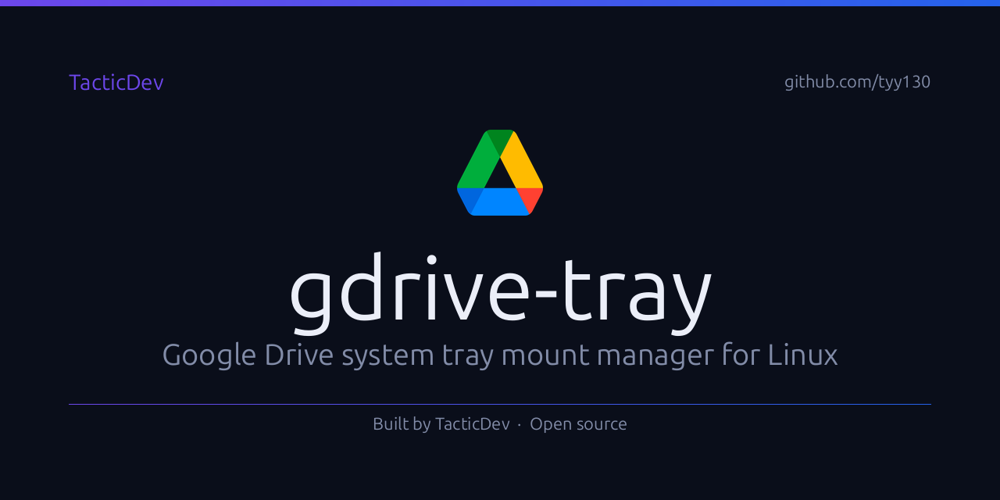

# gdrive-tray

> Google Drive in your system tray.

A minimal Linux system tray app for managing your [rclone](https://rclone.org/) Google Drive mount. Color icon when mounted, greyscale when not. Mount, unmount, and open your Drive folder without touching a terminal.



---

## Features

- **Color / greyscale icon** — see mount state at a glance
- **One-click mount / unmount** — no terminal needed
- **Desktop notifications** — success and error alerts via libnotify
- **Open folder** — launch your file manager to the Drive mount point
- **Auto-refresh** — icon updates after every mount/unmount operation

---

## Requirements

| Dependency                    | Install                                                   |
| ----------------------------- | --------------------------------------------------------- |
| Python 3.10+                  | system                                                    |
| GNOME AppIndicator extension  | `gnome-extensions enable ubuntu-appindicators@ubuntu.com` |
| [rclone](https://rclone.org/) | `sudo apt install rclone`                                 |
| FUSE                          | `sudo apt install fuse`                                   |
| `libnotify`                   | `sudo apt install libnotify-bin`                          |

---

## Install

```bash
git clone https://github.com/tyy130/gdrive-tray.git
cd gdrive-tray
bash install.sh
```

Installs Python dependencies, registers in GNOME app menu, and adds to autostart.

---

## rclone Setup

If you haven't configured rclone yet:

```bash
sudo apt install rclone
rclone config
# Follow prompts → choose Google Drive → name the remote "gdrive"
```

The app expects a remote named `gdrive:` by default. Set `GDRIVE_REMOTE` if yours differs.

---

## Configuration

Set either environment variable in your shell or desktop session before launching:

| Environment variable | Default        | Description           |
| -------------------- | -------------- | --------------------- |
| `GDRIVE_REMOTE`      | `gdrive:`      | rclone remote name    |
| `GDRIVE_MOUNT_POINT` | `~/CloudDrive` | Local mount directory |

---

## Usage

| Action               | Result                           |
| -------------------- | -------------------------------- |
| Left-click tray icon | Open menu                        |
| Menu → Mount         | Mount Google Drive               |
| Menu → Unmount       | Unmount safely                   |
| Menu → Open Folder   | Open mount point in file manager |

---

## License

MIT — see [LICENSE](LICENSE)

---

Built by [TacticDev](https://github.com/tyy130)
